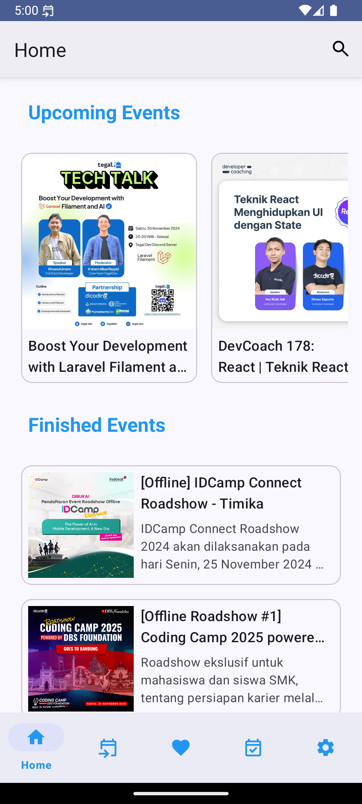
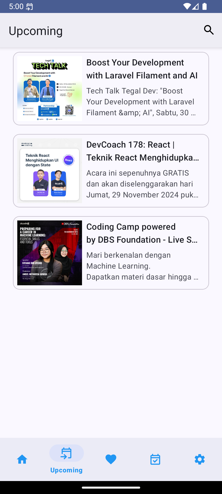
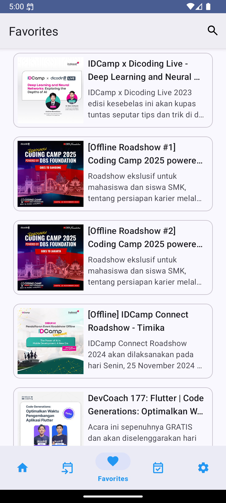
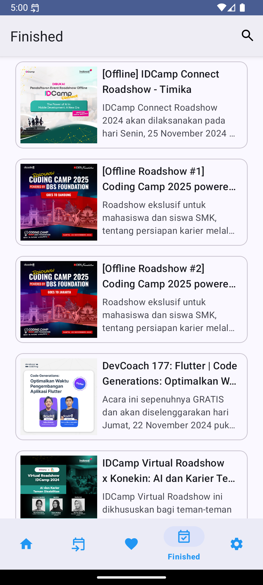
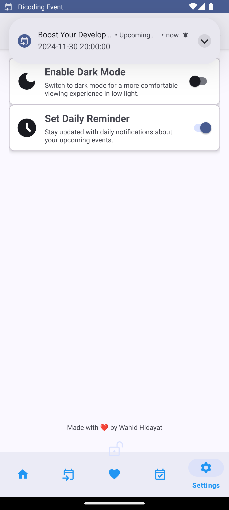
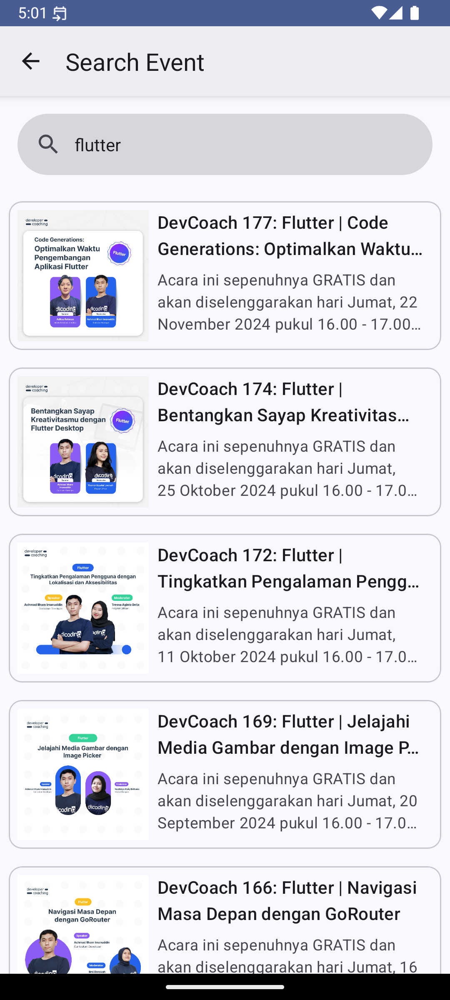

# Dicoding Event

**Dicoding Event** is an Android application designed to help users discover, save, and participate in various events hosted on the Dicoding platform. The app offers a seamless user experience with features tailored to enhance event discovery and participation.

---

## 🚀 Key Features
- **Upcoming Events**: View a list of upcoming events.
- **Finished Events**: Explore completed events.
- **Favorites**: Save favorite events for offline access using Room Database.
- **Event Details**:
  - Comprehensive information about each event, including:
    - Location
    - Schedule
    - Description
  - **UI Features**:
    - **ImageView** for event cover.
    - **TextView** for event details (name, organizer, time, quota, and description).
    - **FloatingActionButton** to add events to favorites.
    - **Button** for event registration.
    - **Error Page** with retry functionality.
    - **ProgressBar** for loading indicators.
- **Settings**:
  - Dark Mode for a comfortable viewing experience at night.
  - Daily Reminder for notifications about new events.
- **Search**: Quickly find events by keyword.

---

## 📸 Screenshots

### Home Screen


### Upcoming Events Screen


### Favorite Events Screen


### Finished Events Screen


### Settings Screen


### Search Screen


---

## ⚙️ Initial Setup

### Prerequisites
Before starting, ensure you have the following:
- **Android Studio** (Arctic Fox or newer)
- Latest **Gradle** version
- **Java Development Kit (JDK)** version 11 or newer

### Installation
1. Clone the repository:
   ```bash
   git clone https://github.com/whdhdyt21/Dicoding-Event.git
   ```
2. Open the project in Android Studio.
3. Configure the `local.properties` file by adding the following:
   ```properties
   BASE_URL=https://event-api.dicoding.dev/
   ```
   > **Note:** The `local.properties` file stores sensitive local configurations and is excluded from version control.

4. Build and run the application in Android Studio.

---

## 🛠️ Technologies Used
- **Kotlin**: Main programming language for development.
- **MVVM Architecture**: Ensures separation of concerns for better maintainability.
- **Retrofit**: Handles REST API communication.
- **Room Database**: Manages local storage of favorite events.
- **LiveData & ViewModel**: Provides reactive and lifecycle-aware data management.
- **WorkManager**: Schedules daily reminder notifications.
- **Material Design**: Delivers a modern and user-friendly interface.

---

## 🤝 Contribution
Contributions are welcome! If you’d like to improve the project, follow these steps:
1. Fork this repository.
2. Create a feature branch:
   ```bash
   git checkout -b feature/your-feature-name
   ```
3. Commit your changes:
   ```bash
   git commit -m "Add feature: your-feature-name"
   ```
4. Push the branch:
   ```bash
   git push origin feature/your-feature-name
   ```
5. Open a pull request on GitHub.

---

## 📜 License
This project is licensed under the [MIT License](LICENSE).
